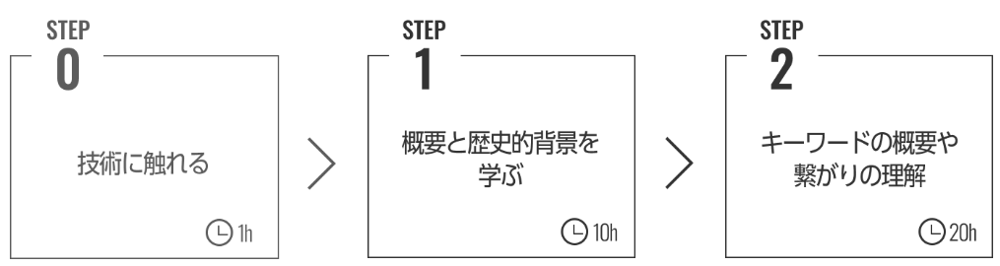

# 学習ロードマップについて

- 機械学習またはLLMを用いたプロダクトを開発するためには前提知識を学ぶ必要があります。
- [松尾・岩澤研究所](https://weblab.t.u-tokyo.ac.jp/lecture/learning-roadmap/)では、機械学習の基礎から応用までの学習ロードマップが提供されています。

## 1.Level0:人工知能の基礎知識を身につける

### [技術に触れる]
- 最新のAI技術に触れて，AIによってどのようなことができるのかを確認します。

### [人工知能の概要と歴史的背景を学ぶ]
- 第一線で活躍する研究者の講義や著書を通して、人工知能の概要と歴史的背景を学びます。
  - [人工知能は人間を超えるか ディープラーニングの先にあるもの](https://www.amazon.co.jp/%E4%BA%BA%E5%B7%A5%E7%9F%A5%E8%83%BD%E3%81%AF%E4%BA%BA%E9%96%93%E3%82%92%E8%B6%85%E3%81%88%E3%82%8B%E3%81%8B-%E8%A7%92%E5%B7%9D%EF%BC%A5%EF%BC%B0%EF%BC%B5%EF%BC%A2%E9%81%B8%E6%9B%B8-%E6%9D%BE%E5%B0%BE-%E8%B1%8A-ebook/dp/B00UAAK07S/ref=tmm_kin_swatch_0)
  - [AI白書 2025 生成AIエディション](https://www.amazon.co.jp/AI%E7%99%BD%E6%9B%B8-2025-%E7%94%9F%E6%88%90AI%E3%82%A8%E3%83%87%E3%82%A3%E3%82%B7%E3%83%A7%E3%83%B3-%E6%9D%B1%E4%BA%AC%E5%A4%A7%E5%AD%A6-%E6%9D%BE%E5%B0%BE%E3%83%BB%E5%B2%A9%E6%BE%A4%E7%A0%94%E7%A9%B6%E5%AE%A4/dp/4049112388/)

### [技術的キーワードの概要や繋がりを学ぶ]
- 人工知能の概要がわかったら、次に現在の人工知能の中心技術である深層学習についての基礎知識を身につけます。

## 2.Level1以降
- 機械学習の基礎（Level0）を学んだ後は、以下のロードマップに沿ってそれぞれの分野に応じて学習や実践を行います。

｜[<<LLMについて](./2_LLMについて.md) ｜[予測モデル作成>>](./4_予測モデル作成/4_予測モデル作成.ipynb)｜